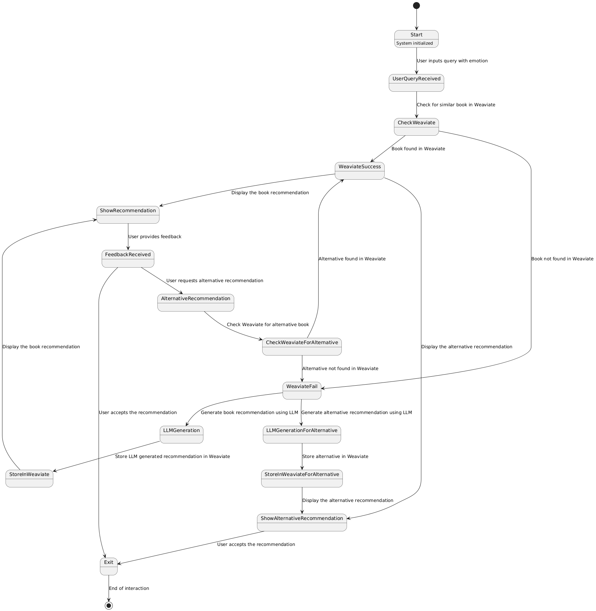

# BookRecommendationChatbot

```markdown
# Book Recommendation System

This Book Recommendation System is a personalized application designed to suggest books to users based on their emotions and query context. The system uses natural language processing (NLP), sentiment analysis, and context-aware techniques to provide relevant book recommendations. It integrates with Weaviate, a vector search engine, for storing and retrieving user interactions and recommendations.

## Features

- **Emotion Detection**: Detects the user's emotion from the query and uses it to tailor book recommendations.
- **Context-Aware Recommendations**: Considers both the user's query and detected emotion to recommend books.
- **Feedback Mechanism**: Allows users to provide feedback if they have already read a book or do not like the recommendation, leading to an alternative suggestion.
- **Weaviate Integration**: Stores user interactions and recommendations in Weaviate, enabling efficient retrieval for similar future queries.

## Installation

### Prerequisites

- Python 3.8+
- Pip (Python package installer)

### Install Dependencies

1. Clone the repository:
   ```bash
   git clone https://github.com/your-username/book-recommendation-system.git
   cd book-recommendation-system
   ```

2. Install required Python packages:
   ```bash
   pip install -r requirements.txt
   ```

3. Install additional dependencies if needed:
   ```bash
   pip install weaviate-client transformers fastapi uvicorn
   ```

## Usage

### Running the Application

1. Start the FastAPI server:
   ```bash
   uvicorn main:app --reload
   ```

2. Access the application by navigating to `http://127.0.0.1:8000` in your web browser.

### Interacting with the Application

- **Submit a Query**: Enter a query that reflects your current mood or emotion. The system will analyze the text to detect the underlying emotion and context.
- **Receive Recommendations**: The system provides a book recommendation based on the emotion and context detected from the query.
- **Provide Feedback**: If you’ve already read the recommended book or do not like it, you can request an alternative recommendation.
  
### API Endpoints

- `POST /recommend`: Accepts a query and returns a book recommendation based on the detected emotion and context.
- `POST /feedback`: Allows the user to provide feedback on the recommended book.

## Architecture

The system consists of the following key components:

1. **Emotion Detection Module**: Detects the user’s emotion using NLP techniques.
2. **Weaviate Integration Module**: Manages the storage and retrieval of user interactions and recommendations.
3. **Recommendation Engine**: Combines emotion detection and query context to suggest relevant books.
4. **Feedback Handler**: Processes user feedback and provides alternative recommendations if necessary.


## UML Diagram

The system's workflow is represented in the following UML State Diagram:



## Contributing

Contributions are welcome! Please follow these steps:

1. Fork the repository.
2. Create a new branch (`git checkout -b feature-name`).
3. Make your changes.
4. Commit your changes (`git commit -m 'Add some feature'`).
5. Push to the branch (`git push origin feature-name`).
6. Open a Pull Request.

## License

This project is licensed under the MIT License - see the [LICENSE](LICENSE) file for details.

```
